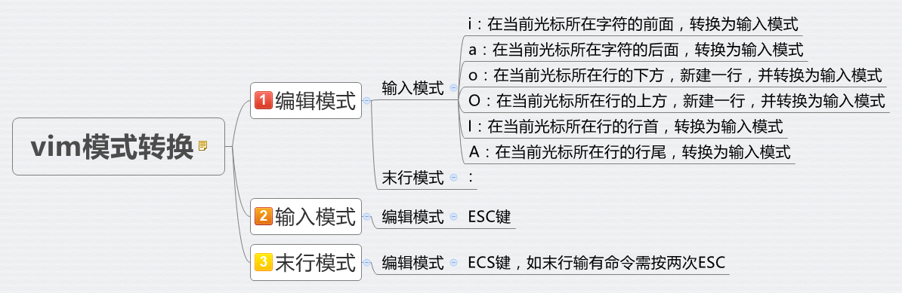

vimrc配置讲解 


>  B站THECW
>
> github theniceboy

```
"~/.vim/.vimrc
set scrolloff=5
上下移动浏览代码时，保证光标总在相对中间区域，上下总是流出5行

let &t_SI = "\<Esc>]50;CursorShape=1\x7" 
let &t_SR = "\<Esc>]50;CursorShape=2\x7" 
let &t_EI = "\<Esc>]50;CursorShape=0\x7" 
可能仅适用于alarcitty终端模拟器，目的是使vim在insert插入模式下，光标显式为细线，像是在其他编辑器当中的显式习惯

map <LEADER>sc :set spell!<CR>
"打开或关闭拼写检查，检查到错的单词会有下划线标识，然后click z= 就可以弹出来建议候选词列表


分屏小技巧
vsplit / vs 向右分屏
但每次分屏后，光标默认还在原窗口，如何使光标自动切换至新分屏出的窗口呢？
:set splitright
:set nosplitright  #向左分屏
如法炮制以及映射快捷键
map si :set splitright<CR>:vsplit<CR>
map sn :set nosplitright<CR>:vsplit<CR>
map su :set splitbelow<CR>:vsplit<CR>
map se :set nosplitbelow<CR>:vsplit<CR>
然后在新窗口打开新文件， :e newfilePath
在多个窗口之间切换，ctrl+w + (w,h,j,k,l) 上下左右方向切换窗口, 但每切换一次都要ctrl+w，因此map映射如下
map <LEADER>i <C -w>l
map <LEADER>u <C -w>k
map <LEADER>n <C -w>h
map <LEADER>e <C -w>j

更改分屏大小
:res resize-5   # 左右分屏
:vertical resize-5  #上下分屏
map如下：
map <up> :res +5<CR>
map <down> :res -5<CR>
map <left> :vertical +5<CR>
map <right> :vertical +5<CR>
```

快捷键

dtg 快速删除到某个char

比如`https://github.com/`  如何快速删除github前面的部分？ 试试`dtg` ，太强了

```
ctrl + o 
ctrl + i
vim最近打开的文件位置信息，前进、后退。这个很厉害，可以跨文件，即便退出重新进入vim仍然有效，可以

vim在浏览文件，比如如果文本内容出现文件path，vim可以自动识别出来，以下划线标识，这种情况可以按 gf 快速跳转到该文件，再搭配ctrl o/i实现跳转

ctrl + a
vim可以对文本中的数字加1、减1操作
ctrl + x

打开新标签
:tabe
如何在标签之间切换
+tabnext
-tabnext
```

  

在个人或公司开发docker等多台机器跨越使用，无缝切换vim的个人配置

vim配置文件放到github上，clone下来，实现vim的全自动配置，插件自动安装

有趣的工具

将文本转化为特殊字符的文本，类似用特殊字符拼图案

figlet vim

screenfetch 

比如在vim编辑文件时，插入一段这类内容

`:r !figlet  helloworld`

vim自带将内容导出为html或者pdf文件的功能，比如代码文件可以让有很好的阅读体验

`:%TOhtml`


多行选中，添加相同内容，比如改写test_op.py时

v :normal K toInsert

v进入visual模式，:normal执行normal模式的指令

如果整个文件，就是VG

网上说的vblock模式，多行insert时，只显示了第一行，其实按ESC后就能成功了


#### vim-Plug插件管理器
##### [Vim轻量高效插件管理神器vim-plug介绍](https://www.jianshu.com/p/55b769df5dfa)
###### 插件管理器vim-plug安装及使用
1、安装

vim-plug使用github进行托管和维护，只需要下载对应的 plug.vim 文件并保存到 autoload 目录即可完成安装。

[ubuntu系统下可使用以下命令快速安装vim-plug](https://www.jianshu.com/p/55b769df5dfa)
```
    mkdir ~/.vim/autoload/

    cd~/.vim/autoload/

    wget https://raw.githubusercontent.com/junegunn/vim-plug/master/plug.vim

或者 

在终端输入以下命令，该命令用于安装插件管理器

    curl -fLo ~/.vim/autoload/plug.vim --create-dirs \

        https://raw.githubusercontent.com/junegunn/vim-plug/master/plug.vim
```

###### 插件的添加
vim-plug下载成功后，打开~/.vimrc

    vim ~/.vimrc

在vim配置文件.vimrc下加入如下配置字段:

格式:`Plug 'vim-airline/vim-airline' `每个插件写一行这个，然后放在

```
...
call plug#begin('~/.vim/plugged')

Plug 'vim-airline/vim-airline'
Plug 'connorholyday/vim-snazzy'

call plug#end('~/.vim/plugged')
```

然后在vim的命令模式下
 `:source ~/.vimrc    生效vimrc   `
 `:PlugInstall       开始这些安装插件`

###### 删除插件
将`~/.vimrc`中要删除的插件那一行给删除或者注释
`    " Plug 'scrooloose/nerdtree'`
然后执行
`:source ~/.vimrc `使这个配置文件生效，最后执行` :PlugClean`

###### 插件自动启动
vim ~/.vimrc 在后面加入：

    autocmd VimEnter * NERDTree

这是让nerdtree插件自动启动，现在我们使用vim随便打开一个文件，在左侧就会出现目录树


插件搜索可以在 https://vimawesome.com/


Pacman

是ArchLinux系列发行版的软件包管理器，相比Ubuntu的apt异常强大，对软件管理功能简单而强大，在Ubuntu上apt时经常需要add repo源，经常还可能遇到repo源变更，让人烦躁。

如果你从Ubuntu转到Arch，你可能困惑pacman如何使用，手册很长。常用指令来进行总结如下：三类

S - 查询search类

```
# 安装软件如vlc
sudo pacman -S vlc  

# 从arch源获取软件库信息更新，注意更新库，不更新软件
sudo pacman -Sy
sudo pacman -Syy

# 更新软件到新版本
sudo pacman -Su

# 类似地，更新软件源，并更新软件
sudo pacman -Syu

# 搜索所有已安装的软件名带vim的结果，信息很丰富，包括名字，位置，版本，简介
sudo pacman -Ss vim

# pacman也支持正则表达式，如搜索所有以vim开头的
sudo pacman -Ss ^vim
```

R - 删除 remove类

```
# 简单删除一个软件，但不包含其安装时附带的依赖dependency
sudo pacman -R vim

# 比如你安装一个视频播放器，其本身也依赖一些其他软件包，这在pacman会自动搜索依赖包并安装，如果要将其依赖一并删除,可以看到提示的删除size与上一条指令差别很大
sudo pacman -Rs vim  

sudo pacman -Rns vim  # 这是最推荐的删除方式
# 删除依赖包，删除该软件的全局配置文件，但不会删除home目录下的.vim

```

Q - 查询Query

```
# 查询安装了哪些软件，包含系统软件
sudo pacman-Q | wc -l  

# 只查询自己安装的软件
sudo pacman-Qe | wc -l

# 同上，查询结果不显示版本号
sudo pacman-Qeq | wc -l

sudo pacman -Qs vim

# 可以想到，时间久了，会有一些软件包不再被依赖，成为孤儿包，这种如何查询
sudo pacman -Qdt

# 也支持shell的变量
sudo pacman -R $(pacman -Qdtq)
```

PacMan的配置

`sudo vim /etc/pacman.conf`

```
Color # 彩色显式pacman，默认是白色

IloveCandy  # 更改#的显式图标

源， 国内对arch的源支持很好
[core]
[extra]
[multilib]

# 增加自己的新的源
[archlinuxcn]
SigLevel = Optional TrustedOnly
Include = /etc/pacman.d/archlinuxcn  # 这文件需要自己创建, 里面按照格式，上到下优先级搜索顺序填写自己的源，可以网上搜一下arch的国内源，就可以了
```


#### 刘傲天 B站-[配置vim如此简单，如何从零配置你自己的vim](https://b23.tv/YzSEda)

##### [来自liuaotian的各种配置文件](https://github.com/lliuaotian/At-config)

```
.tmux.conf
.vimrc
.zshrc
alacritty.yml
i3status.conf
```

##### [.vimrc配置讲解](https://github.com/lliuaotian/At-config/blob/master/.vimrc)

```
" 让vim配置保存后立马生效, 默认配置是需要source ~/.vimrc
autocmd BufWritePost $MYVIMRC source $MYVIMRC

" 设置自己的leader键, 为了便于组合改键
let mapleader=","

" 关于保存退出文件相关， 意思是 Leader + w，映射为 :w回车。 <CR> 表示回车Enter
nmap <Leader>w :w<CR>

" 不保存直接退出
nmap <Leader>q :q!<CR>

" 跳转Window，<C-h> 表示 ctrl + h（同时按住），映射成ctrl+w，放开后+h
nnoremap <C-h> <C-w>h

" 快速跳转
nmap J 3j
nmap K 3k

" 打开文件类型侦测
filetype on
" 根据不同的文件类型加载不同的插件
filetype plugin on

" 开启实时搜索并且对大小写不敏感
set incsearch
set ignorecase

" 开启vim自身命令行模式智能补全
set wildmenu
```


#### tmux

解决ssh断连后，进程被杀，ssh连接上下文清理的问题。

为了解决ssh断开连接导致执行一半的程序被杀死，我们会用tmux / screen一类的程序来帮我们做断线运行。

[tmux使用笔记](http://wwj718.github.io/post/%E5%B7%A5%E5%85%B7/screen-and-tmux/)

[.tmux](https://github.com/gpakosz/.tmux)
.tmuxconf生效  tmux source-file ~/.tmuxconf


#### Alacritty - 现今最快的电脑终端

使用Alacritty一定要改config，默认第一次打开alacritty非常丑，必须在`~/.config/alactitty/` 创建配置文件。其定制性非常高

##### installation

```
----------- [Arch Linux] ----------- 
# pacman -S alacritty  

----------- [Debian and Ubuntu] -----------
$ sudo add-apt-repository ppa:mmstick76/alacritty
$ sudo apt install alacritty
```

##### [config](  ~/.config/alacritty/alacritty.yml)

###### [官方alacritty.yml](https://github.com/alacritty/alacritty/blob/master/alacritty.yml)

###### [我的Alacritty配置](https://www.cnblogs.com/siyingcheng/p/11706436.html)


#### Shell工具 Bash Zsh Fish

###### [从 zsh 到 fish, 让你的 shell 更可爱更友好](https://juejin.cn/post/6844903625257385997)

[fish比zsh好用吗？](https://www.zhihu.com/question/41076349)

[Fish Shell使用心得](https://www.jianshu.com/p/bf03bce60987)


\#fish fish正如它的全称`Friendly Interactive Shell`


#### lazygit

出现6个面板，可以通过键盘的左右方向键来切换


Status - lazygit状态
Files - 当前工作目录下，文件状态
Local Branch - 分支状态
Commits - 提交记录
Stash - 隐藏的更改
这几个面板都很重要，每个pane的快捷键都不同，在pane上按x可以查看对应的快捷键，

##### lazygit最常用功能
files 面板
快速stage
切换到Files pane，按a全部stage/unstage，挨个操作可以按回车enter到右侧大框pane，然后空格space一个个选中，左右键可以查看详细改动，然后tab键在上下的staged, unstaged切换。d 删除更改。files面板按c来提交，A表示--amend提交，C来编辑这个commit信息，快速清理工作目录

Local Branch面板
默认显式的是本地所在分支，n创建分支，空格切换branch，p发布push到远端，M把选中的分支合并到当前分支，还可以查看remotes，tag信息

stash面板
s表示stage操作，g-pop一次stash，空格可以stash apply，d表示drop stash，可以用上下左右在stash面板切换选择多个stashId

Commits面板
可以给commitId打标签tag，[]在面板标签之间跳转，在commitId上按回车enter，查看具体修改内容，对这些文件还可以按d对该commitId对文件的修改删掉，以及回退revert，反复按ESC可以一直回到commitId列表，当然列表会很长，可用, . 翻页，<>到最顶端/底端，还可以用vim快捷键 /来搜索，更改commit messege：按r，R可以转到编辑器中修改。空格可以checkout不同的commitId，g可显示可选的reset选项，c可以复制多个commitId到指定branch，达到cherry-pick的效果，d删除commitId，或在branch面板中d删除分支，压缩提交，即rebase，用s以squash方式合并，f也可以以fixup方式来合并commit，这两种方式commit messege不同。


解决冲突conflict
存在冲突的2个分支合并，按M进行合并Merging，接下来在右侧大框中显示冲突具体内容，一群`<<<<<<`  `>>>>>>>>` ,  按回车Enter进入右侧冲突界面，然后上下键选择冲突的哪个更改，按空格space选择outgoing修改还是incoming修改，然后冲突就这样解决了，如果2种改动都想要，可以按b两种更改都将保留，当冲突部分都解决完后，界面会自动弹出`all merge conflicts resolved, Continue?`  

小技巧：
查看某个文件的历史commit改动记录，可以按ctrl + f 进行过滤Filtering，这个还是非常方便的，在commit面板，按M可以对不同的commit间进行对比，看commit之间的diff

lazygit的快速打开配置
1. 在文件浏览器ranger中，到ranger配置文件`~/.config/ranger/rc.conf` 添加一行
   `map <c-g> shell lazygit`  意思是 ctrl+g

2. shell命令行的任意位置，以zsh为例，可以设置 alias lg=`lazygit` , 也可以在zsh的配置文件添加map
3. vim/neovim中快速打开lazygit ，在命令模式 :term   就可以在vim中打开一个终端， 或者更快的启动方式直接在vimrc中添加map快捷键  `noremap <c-g> :tabe<CR>:-tabmove<CR>:term lazygit<CR>`   <CR>表示回车

lazygit的配置
可以看官方的github，`docs/Config.md` 快捷键是由TheCW贡献。快捷键请看`docs/keybindings/Custom_Keybindings.md` 
   
