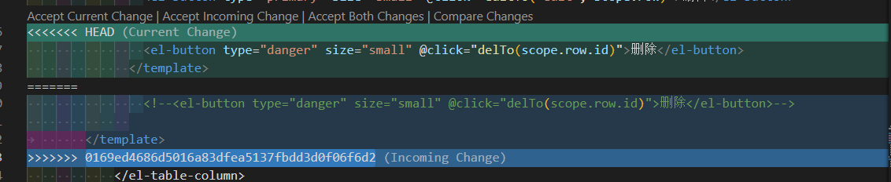
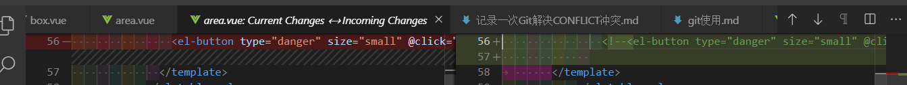
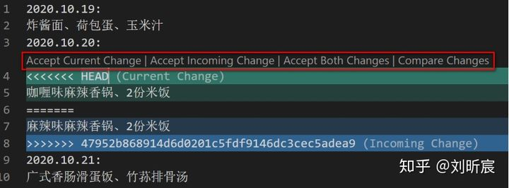

#### VS Code解决冲突


文件的冲突解决，此处有4个选项：

| 选项                   | 含义                       |
| :--------------------- | :------------------------- |
| Accept Current Change  | 接受当前分支1的修改        |
| Accept Incoming Change | 接受pull导入主分支的修改   |
| Accept Both Change     | 同时接受两个分支的修改     |
| Compare Changes        | 对比修改，主要用于手动修改 |



**Compare Changes示意图**
 

**补充说明**：使用VS Code这类工具手动解决冲突会更加方便：

将项目在VS Code中打开：



点击Accept Current Change，就是接受当前的“咖喱味麻辣香锅”

点击Accept Incoming Change，就是接受新来的“麻辣味麻辣香锅”


##### [difference between `Accept Current changes` and `Accept Incoming changes`](https://stackoverflow.com/questions/59607874/github-difference-between-accept-current-changes-and-incoming-changes/63902080) 

It depends on the type of operation ([merge or rebase](https://stackoverflow.com/a/7062773/6309)) leading to that conflict.

In your case, a merge, where:

- **current change** represents what you have (the destination of the merge)
- **incoming change** represents what you merge (the source of the merge)

Then:

- Option 1 ("Accept Incoming changes") would ignore completely what you had, and keep what you merge.
- Option 2 ("Accept current changes") would ignore completely what you merge, and keep what you had.

Don't forget, **in case of a rebase, ["what you have" and "what you merge" are reversed](https://stackoverflow.com/a/2960751/6309).**


---

**补充说明**：当遇到有本地冲突，无法git pull时，可以尝试git stash和git stash pop

```bash
git stash
git pull
git stash pop
git push
```

### 向github添加本地已有项目Project
点击 `New Repository` 
然后按照向导，将本地项目与远端添加关联
…or create a new repository on the command line
```
echo "# WorkNotes" >> README.md
git init
git add README.md
git commit -m "first commit"
git branch -M main
git remote add origin git@github.com:wangdach/WorkNotes.git
git push -u origin main
```
…or push an existing repository from the command line
```
git remote add origin git@github.com:wangdach/WorkNotes.git
git branch -M main
git push -u origin main
```