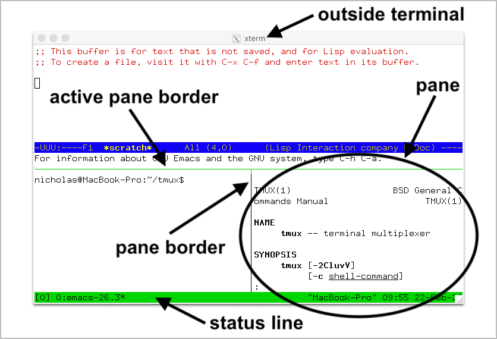
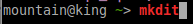
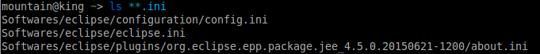
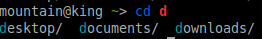
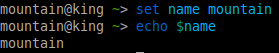
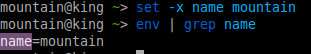
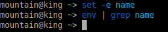
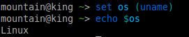
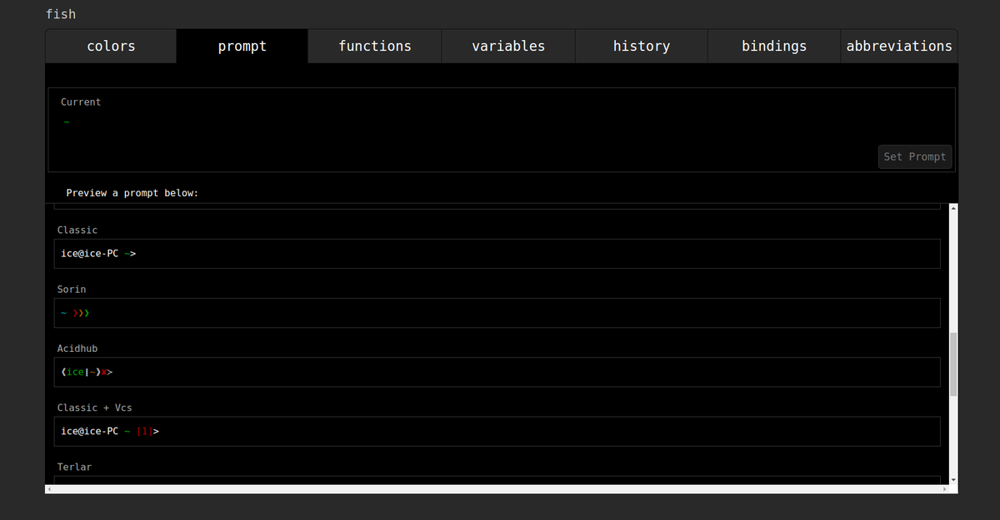
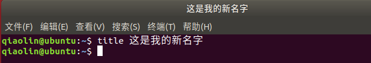

#### Linux发行版

[清华大学开源软件镜像站 ](https://mirrors.tuna.tsinghua.edu.cn/) 

##### Ubuntu

##### [Manjaro](https://manjaro.org/get-manjaro/)

###### [Manjaro 常用软件和命令行推荐](https://www.zhyong.cn/posts/604/)

###### Manjaro安装后配置

manjaro切换中国镜像源
方法1： `pacman-mirrors --country China && pacman -Syyu`
方法2： 生成可用中国镜像站列表：
`sudo pacman-mirrors -i -c China -m rank`
勾选源，最后刷新缓存：`sudo pacman -Syy`

Manjaro可以使用manjaro-settings-manager很方便的切换内核

可选：增加`archlinuxcn`源, 这个源并非完全适用manjaro，可能会导致不稳定
增加archlinuxcn源
编辑/etc/pacman.conf,增加以下
```
[archlinuxcn]
Server = https://mirrors.aliyun.com/archlinuxcn/$arch
```

```
Archlinux或者manjaro开启ssh服务命令
systemctl enable sshd.service 开机启动
systemctl start sshd.service 立即启动
systemctl restart sshd.service 立即重启
```

[安装谷歌拼音输入法](https://blog.csdn.net/Neutionwei/article/details/108500946)
```
xfce尝试安装搜狗输入法失败，pacman甚至找不到fcitx-sogoupinyin的软件包
sudo pacman -S fcitx-im
sudo pacman -S fcitx-configtool
sudo pacman -S fcitx-googlepinyin


# sudo vim ~/.xprofile
export GTK_IM_MODULE=fcitx
export QT_IM_MODULE=fcitx
export XMODIFIERS="@im=fcitx"

系统注销后生效
未生效，则手动到 Fcitx配置, inputMethod 添加谷歌拼音
```


###### [常用软件安装](https://www.jianshu.com/p/2d096cd9ad61)
```
sudo pacman -S yay vim

安装中文输入法
搜狗拼音和谷歌输入法一起安装
yay -S fcitx-im fcitx-configtool fcitx-googlepinyin fcitx fcitx-gtk2 fcitx-gtk3  fcitx-qt5 fcitx-sogoupinyin

安装完毕后编辑环境变量增添以下内容
export GTK_IM_MODULE=fcitx
export QT_IM_MODULE=fcitx
export XMODIFIERS="@im=fcitx"


安装下载工具
 yay -S aria2
 yay -S uget

yay -S google-chrome
yay -S virtualbox

安装深度截图工具
yay -S deepin-screenshot
yay -S flameshot

安装压缩解压工具
yay -S p7zip file-roller unrar

安装wps-office
yay -S wps-office-cn wps-office-mui-zh-cn ttf-wps-fonts 
or
yay -S wps-office
yay -S ttf-wps-fonts

安装vscode
yay -S visual-studio-code-bin

安装markdown编辑器
yay -S typora

安装pdf阅读器
yay -S foxitreader

安装终端复用工具tmux
yay -S tmux

安装docker
# 安装docker
yay -S docker
# 启动docker服务
sudo systemctl start docker 
# 查看docker服务的状态
sudo systemctl status docker
# 设置docker开机启动服务
sudo systemctl enable docker

使用普通用户执行docker命令

groupadd docker
sudo usermod -a -G docker $(whoami)
newgrp docker
systemctl restart docker

安装npm，nodejs

yay -S npm nodejs
# 安装cnpm
sudo npm install -g cnpm --registry=https://registry.npm.taobao.org 
# 在当前用户目录下创建~/.npm-global目录用于存放下载的包，避免使用默认的包路径时提示没有权限
mkdir ~/.npm-global
# 更改链接
npm config set prefix '~/.npm-global'
# 在用户的profile下增加path，为的是系统能够找到可执行文件的目录
export PATH=~/.npm-global/bin:$PATH
# update profile。使其生效
source ~/.profile
```


#### 软件安装

indicator-sysmonitor 

   

    sudo apt-get update
    sudo add-apt-repository ppa:fossfreedom/indicator-sysmonitor
    
    # build-essential[gcc，g++，make，libc等一整套工具的安装]
    apt-get install build-essential openssh-server openssh-client git rar unrar tmux htop manpages-dev
    
    # manpages使用
    mandb -c 
    man fopen 
    sudo apt-get install manpages-zh //中文man手册，linux操作系统的必备资料
    meld //基于gonme的目录差异比较工具，可以比较文件夹和文件的变化
    sudo apt install htop //一款很好的控制台下使用的系统性能监控程序
    sudo apt-get install aria2 //一个基于命令行的高速多线程下载工具
    
    apt-get install indicator-sysmonitor python3-pip cmake
    
    # shutter截图软件、Gif图录制、SMPlayer、kget下载工具、FTP客户端、VLC视频播放器
    apt-get install shutter peek smplayer kget filezilla vlc
    
    # Android投屏程序Scrcpy、Typora / joplin
    sudo snap install typora scrcpy 
    
    # google拼音输入法
    sudo apt-get install fcitx fcitx-googlepinyin
    
    # ubuntu预装的是vim tiny版本，而需要的是vim full版本
    sudo apt-get remove vim-common
    sudo apt-get install vim 
    
    # 安装zsh、fish
    sudo apt-get install zsh
    配置成为默认shell工具
    chsh -s /bin/zsh
    chsh -s /bin/bash
    安装oh-my-zsh
    sh -c "$(curl -fsSL https://raw.githubusercontent.com/robbyrussell/oh-my-zsh/master/tools/install.sh)"  


```
ssh-keygen -t rsa # 生成ssh, id.pub设置到git仓库上
Firefox
Chrome

# 搜狗输入法
$ echo deb http://archive.ubuntukylin.com:10006/ubuntukylin trusty main | sudo tee /etc/apt/sources.list.d/ubuntukylin.list
$ sudo apt-get update   
$ sudo apt-get install sogoupinyin

wps
sudo apt-get install wps-office

redshift护眼工具
> sudo apt-get install redshift
kazam 录屏
> sudo apt-get install kazam 

fsearch # everything替代品
VSCode
PyCharm


screenkey # 按键屏幕实时显示

tmux

Foxit reader

Electronic WeChat
xmind
Ducky # mac风格的底部任务栏
网易云
Listen 1 # https://listen1.github.io/listen1/
sudo apt-get install thunderbird
sudo apt-get install xrdp # win远程访问Linux桌面
安装插件：sudo yum -y install tigervnc-server
启动服务：/bin/systemctl start xrdp.service
sudo systemctl enable xrdp
sudo systemctl start xrdp

sudo apt install krdc # KDE桌面的rdp和vnc连接

Remmina # Linux->Linux, Linux->Win
sudo apt-get install remmina remmina-plugin-*
Remmina 远程桌面客户端
sudo apt-get install remmina

sudo apt install rdesktop  #Linux远程登录Windows
安装完成之后，使用类似下面的命令来访问远程Windows系统。
rdesktop -g 1440x900 -P -z -x l -r sound:off -u windowsuser 192.168.31.100:3389
```

##### [Ubuntu常用软件汇总](https://blog.csdn.net/a18838956649/article/details/101198455)

>   **AppImageLauncher**  **TeamViewer**  **百度网盘**  **WPS全家桶**   **微信Electronic-WeChat**   **XMind**   **FileZilla**   **Chrome**   **Stacer系统管理工具**   **Albert**   **VScode**   **JetBrains全家桶**   **Pycharm**  **ubuntu-tweak**  **AppGrid — 软件仓管理器**

#### 

#### Linux文本三巨头

##### vim

[一小时带你了解 Vim 常用技巧](https://www.bilibili.com/video/BV1ma4y1a7Kg/?spm_id_from=333.788.recommend_more_video.10)

###### [vim强化方案](https://github.com/ma6174/vim)

 Neovim配置文件地址：https://github.com/KyleJKC/nvim 

https://www.bilibili.com/video/BV1954118742/?spm_id_from=333.788.recommend_more_video.1

###### [vim 插件推荐](https://www.zhyong.cn/posts/ec/)

[Jarvim](https://www.bilibili.com/video/BV1mh411d7qj/?spm_id_from=333.788.recommend_more_video.-1)

##### tmux

窗口结构（Sessions, windows, panes）

  

[十分钟学会 tmux](https://www.cnblogs.com/kaiye/p/6275207.html)

[终端复用工具tmux](https://www.freeaihub.com/article/tmux.html)

[Tmux使用手册](http://louiszhai.github.io/2017/09/30/tmux/#%E5%9F%BA%E6%9C%AC%E6%A6%82%E5%BF%B5)

[Tmux 使用教程](https://www.ruanyifeng.com/blog/2019/10/tmux.html)

[免费在线Linux](https://www.freeaihub.com/shell/)

[tmux使用介绍](https://www.jianshu.com/p/cf86f5219d6d)

[tmux使用指南](https://blog.csdn.net/liumiaocn/category_9733726.html)

 [tmux工具概念和使用](https://www.136.la/nginx/show-202583.html)

[     tmux 终端复用详解         ](https://www.cnblogs.com/wangqiguo/p/8905081.html)

http://caibaojian.com/a-programmer/software/develop-tool/tmux.html

[Tmux 使用教程](https://www.ruanyifeng.com/blog/2019/10/tmux.html)

[打造最强终端之二：Tmux配置及使用教程(含配置文件 tmux.conf)](https://kxcblog.com/post/terminal/2.tmux-tutorial/)


###### 其他命令

```text
# 列出所有快捷键，及其对应的 Tmux 命令
$ tmux list-keys

# 列出所有 Tmux 命令及其参数
$ tmux list-commands

# 列出当前所有 Tmux 会话的信息
$ tmux info

# 重新加载当前的 Tmux 配置
$ tmux source-file ~/.tmux.conf
```

###### 会话(session)命令
前缀 	指令 	描述
Ctrl+b 	? 	显示快捷键帮助文档
Ctrl+b 	d 	断开当前会话
Ctrl+b 	D 	选择要断开的会话
Ctrl+b 	Ctrl+z 	挂起当前会话
Ctrl+b 	r 	强制重载当前会话
Ctrl+b 	s 	显示会话列表用于选择并切换
Ctrl+b 	: 	进入命令行模式，此时可直接输入ls等命令
Ctrl+b 	[ 	进入复制模式，按q退出
Ctrl+b 	] 	粘贴复制模式中复制的文本
Ctrl+b 	~ 	列出提示信息缓存

###### 窗口（window）指令：
前缀 	指令 	描述
Ctrl+b 	c 	新建窗口
Ctrl+b 	& 	关闭当前窗口
Ctrl+b 	0~9 	切换到指定窗口
Ctrl+b 	p 	切换到上一窗口
Ctrl+b 	n 	切换到下一窗口
Ctrl+b 	w 	打开窗口列表，用于且切换窗口
Ctrl+b 	, 	重命名当前窗口
Ctrl+b 	. 	修改当前窗口编号（适用于窗口重新排序）
Ctrl+b 	f 	快速定位到窗口（输入关键字匹配窗口名称）

###### 面板（pane）指令：
前缀 	指令 	描述
Ctrl+b 	" 	当前面板上下一分为二，下侧新建面板
Ctrl+b 	% 	当前面板左右一分为二，右侧新建面板
Ctrl+b 	x 	关闭当前面板（关闭前需输入y or n确认）
Ctrl+b 	z 	最大化当前面板，再重复一次按键后恢复正常（v1.8版本新增）
Ctrl+b 	! 	将当前面板移动到新的窗口打开（原窗口中存在两个及以上面板有效）
Ctrl+b 	; 	切换到最后一次使用的面板
Ctrl+b 	q 	显示面板编号，在编号消失前输入对应的数字可切换到相应的面板
Ctrl+b 	{ 	向前置换当前面板
Ctrl+b 	} 	向后置换当前面板
Ctrl+b 	Ctrl+o 	顺时针旋转当前窗口中的所有面板
Ctrl+b 	方向键 	移动光标切换面板
Ctrl+b 	o 	选择下一面板
Ctrl+b 	空格键 	在自带的面板布局中循环切换
Ctrl+b 	Alt+方向键 	以5个单元格为单位调整当前面板边缘
Ctrl+b 	Ctrl+方向键 	以1个单元格为单位调整当前面板边缘
Ctrl+b 	t 	显示时钟


##### zsh
zsh的vi mode模式
配置方法 ~/.zshrc
```
bindkey -v # 这表示zsh编辑命令使用vi模式，而非emacs

zle -N zle--keymap-select  # 可以根据不同vi模式，光标显式为不同的样式，竖条或方块便于区分
```
绑定更多快捷键，使用bindkey -M vicmd xxx, 具体请看 [Zsh line Editor](http://bolyai.cs.elte.hu/zsh-manual/zsh_14.html)
[TheCW的zsh配置](https://github.com/theniceboy/.config/blob/master/zsh/zshrc)

[The Z Shell Guide](http://bolyai.cs.elte.hu/zsh-manual/)

##### fish shell

###### [fish Tutorial](http://fishshell.com/docs/current/tutorial.html)

```shell
apt install fish # yum, pacman
chsh -s /usr/bin/fish
```

##### [在 shell 中使用 vi 模式](https://linux.cn/article-8372-1.html)
bash默认是用emac操作习惯的，如果熟悉vi/vim，set -o vi之后就可以把命令行当成vi用。每次回车之后默认是在insert模式下，按ESC之后，就回到command模式了。这之后就可以用熟悉的hjkl控制光标；用d删除一行；用$和^把光标移到行首行尾；用w和b移动光标一个单词；用r和R替换一个或多个字符；等所有你熟悉的vi操作。用a，i，A，I，可以回到insert模式，并且把光标放到合适的位置。
默认的vi比较难用，可以继续向~/.bashrc中写入
>EDITOR=vim
export EDITOR

[bash设置为vi模式，如何知道自己是在normal还是insert mode？](https://www.zhihu.com/question/23857131/answer/124738655)
bash 4.2以上编辑 $HOME 目录下的 .inputrc增加：
>set editing-mode vi
set keymap vi-command
set show-mode-in-prompt on

bash提示符前会出现+和:这两种符号，+代表插入/替代模式，:代表普通模式。


###### 语法高亮

不存在的命令显示为红色




 进入 Fish 以后，你注意到的第一件事，可能就是它默认彩色显示。 

```
# 无效命令为红色
$ mkd
# 有效命令为蓝色
$ mkdir
```

 有效路径会有下划线。 

```
$ cat ~/xttblog
```

###### 通配符

集成find命令，递归搜索神器。



###### 智能建议

当按下几个字母后，fish会有智能建议，按下向右箭头将接受建议。


如果采纳建议，可以按下`→`或`Control + F`。如果只采纳一部分，可以按下`Alt + →`。

###### Tab补全

如果补全项超过1个，会列出全部以供选择。



###### 变量

fish是通过set来代替“=”对变量赋值的。



将某目录加入到PATH中也是用set（配置config.fish）：

> set PATH $PATH /home/mountain/shell系统配置

###### Exports

fish没有export命令，需要用set -x来代替。如果需要擦除变量，就执行set -e。



Selection_007.png



###### 路径有效提示

有效路径会有下划线。 如果没有下划线，这个路径不存在。 

> ```
> $ cat ~/somefi 
> ```

###### 命令替换

用法很简单，把命令放在括号里即可。



###### [网页配置fish](https://www.jianshu.com/p/bf03bce60987)

`fish_config` 可以直接跳出网页版本配置fish的界面。 在命令里按enter 即可退出web版本的界面。 

在prompt里面可以自己选择fish终端的主题。



###### [插件管理omf](https://github.com/oh-my-fish/oh-my-fish)

###### 兼容bash脚本

由于fish 很多**不兼容**bash的功能导致了很多脚本无法运行，这一点是很多人吐槽fish的地方，我们需要一种方式来运行bash脚本。

比如

```text
arc land --onto `git rev-parse --abbrev-ref HEAD`
```

这条命令在fish里无法执行。 我们只需要在前面添加一个bash -c 命令即可，如下所示。

```text
bash -c "arc land --onto `git rev-parse --abbrev-ref HEAD`"
```

顺手加个alias就更方便了，可以直接在命令行里使用命令`arcl`。

```text
alias arcl bash -c "arc land --onto `git rev-parse --abbrev-ref HEAD`"
```

对于脚本文件，比如我将需要执行的命令或文件放到`repomerge.sh`

######  Fish 易懂的语法

 Fish 的语法非常自然，一眼就能看懂。if语句

```
if grep fish /etc/shells
    echo Found fish
else if grep bash /etc/shells
    echo Found bash
else
    echo Got nothing
end
```

 switch语句

```
switch (uname)
case Linux
    echo Hi Tux!
case Darwin
    echo Hi Hexley!
case FreeBSD NetBSD DragonFly
    echo Hi Beastie!
case '*'
    echo Hi, stranger!
end
```

 while循环

```
while true
    echo "Loop forever"
end
```

 for循环

```
for file in *.txt
    cp $file $file.bak
end
```


[ubuntu 自定义终端terminal名字title](https://blog.csdn.net/qq_35170213/article/details/86519682)

```bash
vim ~/.bashrc

在打开的文件末尾追加上下面代码并保存。

function title() {
  if [[ -z "$ORIG" ]]; then
    ORIG=$PS1
  fi
  TITLE="\[\e]2;$*\a\]"
  PS1=${ORIG}${TITLE}
}
```

 重新打开终端，输入 title 自定义的名称 

 


#### VSCode插件

container

remote ssh

gitlens

python 

C++

VSCode直连docker

[**VSCode Rainbow Fart**](https://saekiraku.github.io/vscode-rainbow-fart/#/zh/) 