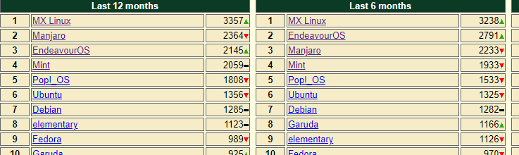
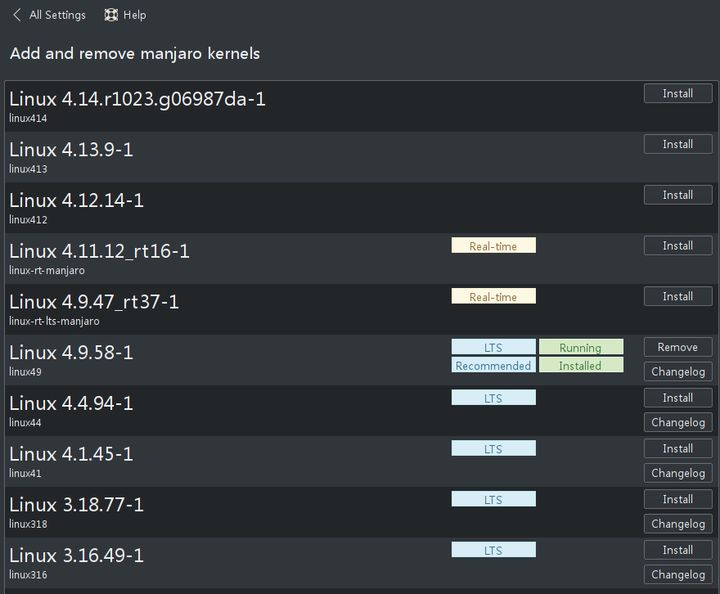

#### Linux发行版选择与对比

##### DistroWatch Page Hit Ranking



##### Linux发行版比较 Manjaro  vs ArchLinux

https://manjaro.org.cn/

[Manjaro与Arch Linux：有什么区别？哪一个更好？](https://zhuanlan.zhihu.com/p/257369966)

[Manjaro和ArchLinux的不同](https://zhuanlan.zhihu.com/p/347923129)

  

对比Ubuntu，Manjaro的优点有下面这几个：

1. 硬件支持。Ubuntu下面装显卡驱动有多麻烦我不多说了
2.  内核管理 
3.  图形化内核管理工具的(UKUU)   Manjaro，出厂自带 

  

软件资源。Ubuntu一直以软件多著称，不过和Manjaro继承自ArchLinux的AUR相比真的太寒酸了。在Manjaro里面，想要装什么软件直接yaourt -S。举个例子吧， [Peek](https://link.zhihu.com/?target=https%3A//github.com/phw/peek)是一个精致小巧的开源屏幕录制软件，ubuntu下安装：

```bash
sudo add-apt-repository ppa:peek-developers/stable
sudo apt update
sudo apt install peek
```

Manjaro/ArchLinux下安装：

```text
yaourt -S peek
```

manjaro真得很不错，ubuntu上装不了的科学计算软件（root,geant4），在manjaro上就可以装上。

 这还是官方提供PPA的，不然Ubuntu用户恐怕得sudo apt-get install build-essentials手动编译了。另外APT依赖问题恐怕每个Ubuntu用户都遇到过，得装个aptitude才能解决一部分。 

4. 桌面环境。虽然说每个人的审美不大一样，不过Unity真的挺丑的——而且你没得选。不是Canonical也说下一个release切换回Gnome了嘛。Manjaro官方提供了KDE/XFCE/GNOME版本，社区提供了Cinnamon/LXDE/i3/LXQT/Mate版。而且切换起来也很简单。

没有什么奇怪的依赖关系，是真的爽！

在解决某个依赖问题的时候，安装了aptitude，然后想删除某个依赖关系的时候不小心删掉整个系统，对，就看着图标一个一个消失，那时我第一次感到如此挫败，从此半年没碰linux，后来因为某些原因，重拾ubuntu，还是一样原汁原味的unity卡的我心痒痒，依赖问题永远无法解决，陷入死循环的依赖简直不要太多，于是不得已又卸载了。 以前搞linux从不敢说完全只用win，但是我觉得遇到了manjaro，真的可以考虑stay in linux了。 

 manjaro唯一的缺点就是没有自带中文输入法，得自己装。(看看人家mint，自带中文输入法多好使，deepin也自带中文输入法 

 manjaro是保留了arch优点，而没有arch那么复杂，就好像它的宣传语一样，享受简单，有一定基础的linux用户首选发行版。 

 从对硬件的支持来说manjaro＞deepin＞Ubuntu。尤其是manjaro对显卡的支持真的令我感动 。之前用Ubuntu时安装显卡驱动烦人得很。而且manjaro切换内核可以在设置里面一键搞定。 

说下优点

1、硬件支持好 ，尤其是显卡驱动，双显卡默认会给你安装bumblebee（无论你是a卡还是n卡）

2、背靠archlinux软件源和archlinux wiki

3、可定制化程度高，你自己可以弄得很漂亮，可以使用不同的桌面环境

Manjaro主要是软件较新, 驱动支持好, 基于Arch, 适合喜欢滚动发行版的.

##### Manjaro不同桌面环境Xfce, KDE, Gnome比较

[Manjaro的官方提供三个桌面都有什么优缺点?](https://www.zhihu.com/question/388762320/answer/1162730954)

 Xfce是用于类似UNIX操作系统的轻量级桌面环境，它的目标是快速和节省系统资源，同时在视觉上吸引人并且对用户友好。 

Xfce版本仍然是我们的旗舰产品，并受到了应有的重视。只有极少数人声称可以提供如此优美，集成且领先的Xfce体验。在此版本中，我们发布了Xfce 4.14，并且主要致力于通过桌面和窗口管理器来完善用户体验。另外，我们已切换到名为Matcha的新主题。一项新功能“显示配置文件”使您可以存储一个或多个用于首选显示配置的配置文件。连接新的显示器后，我们还实现了配置文件的自动应用。

我们的KDE版本提供了功能强大，成熟且功能丰富的Plasma 5.18桌面环境，并具有独特的外观，我们在2020年对其进行了重新设计。整套Breath2主题包括明暗版本，动画启动画面，屏幕，Konsole配置文件，Yakuake皮肤以及更多其他小细节。我们对文本编辑器Kate进行了补充，增加了一些其他配色方案，并提供Plasma-Simplemenu（等离子简单菜单）作为传统的Kickoff-Launcher的替代方案。Manjaro-KDE拥有广泛的最新KDE-Apps 20.04和其他应用程序供您选择，旨在为您提供一个多功能，优雅的环境，满足您的日常需求。

在基于3.36系列的Gnome版本中，我们包括了许多应用程序和界面的可视刷新，尤其值得注意的是登录和解锁界面。GNOME Shell扩展现在使用新的Extensions应用程序进行管理，该应用程序可处理更新，配置，删除或禁用扩展程序。“请勿打扰”按钮已添加到通知弹出框。启用后，通知将隐藏，直到关闭按钮。默认情况下，我们自己的动态壁纸会全天更改其颜色主题。此外，我们更新了GDM，并大大改进了Gnome-Layout-Switcher。我们更新了预装软件包列表，zsh是新的默认外壳，现在将应用程序分类在干净的应用程序抽屉中的文件夹中。

Gnome3我是不太爱用的, 全屏开始菜单即使在物理机上, Intel集显也会卡, 界面风格对我这习惯Windows的来说也不讨喜.


KDE5我也不太爱用, 默认风格有种Window XP的感觉, 整体感觉就是不太有美感.


Xfce默认的虽然也挺丑的, 但是各发行版基本都包装美化了一下, 反而整体美观度好很多, 而且占用资源也相对轻量级.


Cinnamon界面是相对来说最好看的, 就是社区小很多.

##### ISO Download

[OSDN Manjaro ISO Archive](https://osdn.net/projects/manjaro-archive/storage/xfce/20.2.1/) 

### [manjaro-archive 清华开源镜像站](https://mirrors.tuna.tsinghua.edu.cn/osdn/storage/g/m/ma/manjaro-archive/) 

[国内镜像站汇总](https://blog.csdn.net/qq_38978315/article/details/90349499)

[Manjaro Linux distrowatch](https://distrowatch.com/table.php?distribution=manjaro&pkglist=true&version=stable#pkglist)

[distrowatch.com Torrent Archive](https://distrowatch.com/dwres.php?resource=bittorrent)

[最后的选择 SourceForge](https://sourceforge.net/projects/manjarolinux/)

##### ISO刻录装系统

[**Install Manjaro First Steps**](https://manjaro.org/support/firststeps/) 

\4.  桌面环境。虽然说每个人的审美不大一样，不过Unity真的挺丑的——而且你没得选。[不是Canonical也说下一个release切换回Gnome了嘛](https://link.zhihu.com/?target=https%3A//arstechnica.com/information-technology/2017/04/ubuntu-unity-is-dead-desktop-will-switch-back-to-gnome-next-year/)。Manjaro官方提供了KDE/XFCE/GNOME版本，社区提供了Cinnamon/LXDE/i3/LXQT/Mate版。而且切换起来也很简单。


##### [Manjaro安装与配置指南](https://zhuanlan.zhihu.com/p/334808120)

###### [最受欢迎的Linux发行版, Manjaro折腾全记录（超长超详细）](https://cloud.tencent.com/developer/article/1390999)

###### [Manjaro-KDE安装配置全攻略](https://zhuanlan.zhihu.com/p/114296129)

###### [Manjaro配置攻略](https://zhuanlan.zhihu.com/p/139388970)

###### [manjaro 安装与基础设置](https://zhuanlan.zhihu.com/p/83333669)

###### [Manjaro + Xmonad 完全配置指南](https://zhuanlan.zhihu.com/p/106593833)


     


